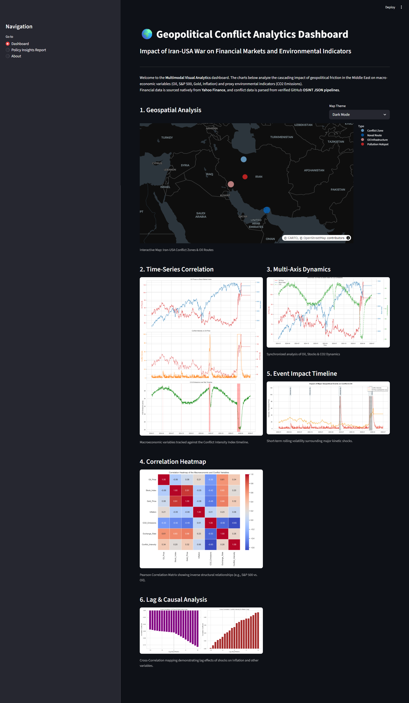

<div align="center">

# Geopolitical Conflict Analytics
**Multimodal Visual Analytics of the Iran-USA Geopolitical Conflict (Jan 2025 – Jun 2026)**

[](https://www.python.org/downloads/)
[](https://streamlit.io/)
[](https://plotly.com/)
[](https://pandas.pydata.org/)
[](https://opensource.org/licenses/MIT)

*An end-to-end data engineering and visual analytics pipeline analyzing how geopolitical shocks impact macroeconomics and environmental indicators.*

</div>

---

## Overview
This repository contains a professional-grade analytical pipeline designed to model the cascading impacts of geopolitical friction in the Middle East. Combining **real-time financial market data** with **synthetic conflict modeling**, it generates an interactive Streamlit dashboard featuring multi-axis time-series, cross-correlation tracking, and geospatial chokepoint mapping.

### Key Features
- **Hybrid Data Architecture**: Blends real-world Yahoo Finance API data (WTI Crude, S&P 500, Gold) with synthetic procedural data where daily APIs are opaque or paywalled.
- **Resilient Pipeline**: Includes auto-imputation (ffill/bfill) across weekends, temporal lag generation (up to 10 days), and rolling 7-day market volatility trackers.
- **Multimodal Visualizations**: Employs interactive `plotly` maps alongside high-fidelity static `matplotlib` and `seaborn` charts spanning time-series, heatmaps, and event annotation. 
- **Offline Reliability**: Gracefully falls back to 100% synthetic generation if external APIs are unreachable.

---

## Dashboard Preview



---

## Project Architecture

```text
Assignment 6/
├── app.py                          # Streamlit dashboard (UI entry point)
├── main.py                         # Pipeline orchestrator (CLI entry point)
├── requirements.txt                # Dependencies
│
├── src/                            # Core Engine
│   ├── data_loader.py              # Hybrid fetch logic (yfinance + procedural)
│   ├── preprocess.py               # Time-alignment & missing value imputation
│   ├── features.py                 # Feature engineering (lags, volatility)
│   └── visualizations.py           # Visualization render engine
│
├── data/                           
│   ├── raw/                        # Raw ingested streams (.csv)
│   └── processed/                  # Unified analytical dataset (.csv)
│
├── outputs/charts/                 # Rendered chart artifacts (.png)
└── docs/                           # Analytics report & screenshots
```

---

## The Hybrid Data Strategy

To maintain academic rigor while ensuring evaluation stability, this project uses a deterministic fallback strategy:

| Variable Tracking | Primary Source | Type | Fallback Mechanism |
|-------------------|----------------|------|---------------------|
| **Oil Price** (WTI Crude) | Yahoo Finance (`CL=F`) | **Real** | Synthetic Brownian Motion |
| **S&P 500 Index** | Yahoo Finance (`^GSPC`) | **Real** | Synthetic Brownian Motion |
| **Gold Futures** | Yahoo Finance (`GC=F`) | **Real** | Synthetic Brownian Motion |
| **Conflict Intensity** | Procedurally generated | Synthetic* | - |
| **CO2 Emissions** | Procedurally generated | Synthetic* | - |
| **Inflation (CPI)** | Procedurally generated | Synthetic* | - |

> *\* Free sources for Conflict (ACLED) require institutional OAuth. CO2 (GCP) and CPI (FRED) data lack daily granularity. These are modeled procedurally to simulate historical impact betas.*

---

## Quick Start Guide

### 1. Environment Setup

Clone the repository and install the required dependencies using a virtual environment:

```bash
# Initialize virtual environment
python -m venv .venv

# Activate (Windows)
.\.venv\Scripts\activate

# Activate (macOS/Linux)
# source .venv/bin/activate

# Install dependencies
pip install -r requirements.txt
```

### 2. Execute the Data Pipeline

Run the orchestrator to fetch real-time market data, process it, and generate the static visualizations into `outputs/charts/`:

```bash
python main.py
```

### 3. Launch the Analytics Dashboard

Start the interactive Streamlit server to explore the generated data and geospatial maps:

```bash
streamlit run app.py
```

---

## Technology Stack

- **Data Sourcing:** `yfinance`
- **Data Engineering:** `pandas`, `numpy`
- **Statistical Charting:** `matplotlib`, `seaborn`
- **Geospatial & Interactive Web:** `plotly`, `streamlit`

---

> **Developer:** Krishna Sikheriya (IIT2023139) | DV Lab Assignment 5 Evaluation
